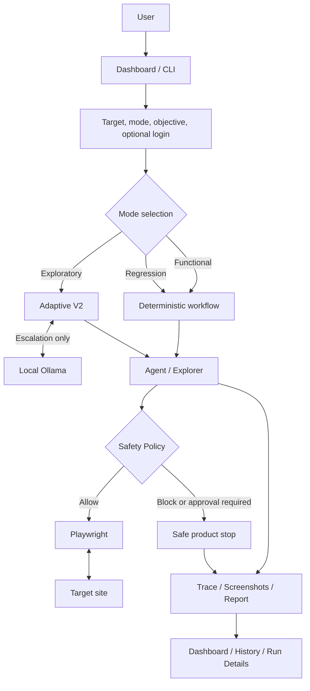

# Vibe-QA

**v0.1.0-alpha released**

Local AI-assisted website testing with deterministic workflows, bounded autonomous
exploration, browser evidence, and safety controls.

Vibe-QA operates a real browser, checks what happened, and records screenshots,
actions, traces, and findings for developers and small teams. It complements
scripted tests; it does not certify that a website is bug-free.

## Why It Exists

Small teams ship faster than they can manually retest every page. Vibe-QA combines
repeatable workflow checks with bounded autonomous exploration and keeps the
evidence available for human review. It runs locally, not as a hosted QA service.

## Core Capabilities

- Deterministic page-text, login, navigation, and explicit native-form workflows.
- Autonomous exploration with page-state coverage and bounded target recovery.
- Redirect-aware exploration and evidence-backed HTTP/visible not-found findings.
- Isolated Playwright sessions and temporary credential redaction.
- Safety decisions before actions: allow, block, or require approval.
- Reports, screenshots, an execution timeline, local history, and optional analysis.

## Testing Modes

| Mode | What runs | Expected visible page text |
| --- | --- | --- |
| Functional | Deterministic supported workflow followed by verification | Required for the local form's final check |
| Regression | Deterministic expectation check | Required for this local check |
| Exploratory | Adaptive V2 exploration; local Ollama only on escalation | Optional additional final-page check |

There is no planner selector in the normal UI. Regression does not yet infer
changes from earlier runs. Functional objectives are bounded commands, not
arbitrary prose understood by a model.

## Architecture



Core Agent approval/resume remains available through the developer callback API.
The dashboard safely stops and closes the browser on approval-required actions;
it does not offer interactive resume. See [Alpha Architecture](docs/ALPHA_ARCHITECTURE.md).

## Local Setup

Use Node.js 18 or later, npm, and a supported Chrome/Chromium installation.
From the repository root:

```bash
npm ci
npm run build
```

The existing browser adapter can use installed Chrome. Without a system browser:

```bash
npx playwright install chromium
```

No paid API key is needed for default Alpha execution.

## Ollama Setup

Exploratory escalation uses the local model `qwen2.5-coder:7b`. Install/start
Ollama and make that model available:

```bash
ollama pull qwen2.5-coder:7b
ollama list
```

The default is IPv4 loopback to avoid Windows/Node resolving `localhost` to
an unsupported IPv6 listener. An environment override is supported:

```ini
OLLAMA_BASE_URL=http://127.0.0.1:11434
```

Set this in the dashboard process environment; no committed environment file is
needed. Functional, Regression, and the default demo do not require Ollama.

## Run The Dashboard

```bash
npm run dashboard:qa
```

Open the printed local URL. A new installation can go straight to **New Test**;
no demo artifacts are required. After updating code, restart the dashboard:
building does not reload an already-running Node process.

## Create A Test

1. Open **New Test** and enter the target URL.
2. Choose **Functional**, **Regression**, or **Exploratory**.
3. Enter the objective and, where applicable, expected visible page text.
4. Enable temporary login only when needed, using the dedicated credential fields.
5. Run the test, then open its report from the status page.

Examples:

- Page check: `Verify that the homepage loads successfully.`
- Login: `Test login functionality`, with temporary credentials and a login-page URL.
- Form: one command per line, such as `Enter Ada in First Name`,
  `Select India as Country`, `Check checkbox Terms`, `Click Submit`.
  Submissions remain subject to approval and may stop safely.
- Exploration: `Explore this website as a first-time user. Navigate safe pages and look for visible failures. Do not perform destructive or sensitive actions.`

Expected text is literal and case-sensitive. Whitespace is collapsed and every
non-empty expected line must appear independently on the final rendered page.
Chinese/Unicode text is preserved. It is not a natural-language expected behavior.

Native form controls and one exact-label navigation target are supported.
Complex login-then-form workflows use the existing structured TestCase API.

## Evidence And Reporting

**Dashboard** opens the latest readable run. **History**, the saved-run selector,
and **Run Details** expose local reports under `run-output/demo/<run-id>/`:

- `report.json`: checks, findings, errors, mode, and execution metadata.
- `trace.json`: observations, actions, safety decisions, and termination details.
- `screenshots/`: real browser evidence, with credential masking.

The summary separates **Passed**, **Issue found**, **Expected result not met**,
**Blocked by safety**, **Approval required**, **Unsupported objective**, and
agent/model/browser/local setup errors. Execution failures are not automatically
called target-site bugs. Technical details remain expandable below the summary.

Actual website findings can include a labeled local analysis baseline. Optional
OpenAI-compatible analysis uses `OPENAI_API_KEY`, `OPENAI_BASE_URL`, and
`OPENAI_MODEL`; it is separate from execution and never required by default.

## Safety And Authentication

Use websites you own or are authorized to test. Risky actions are not implicitly
approved by entering an objective. The local safety policy is a safeguard, not a
hardened network sandbox or a complete understanding of every website's effects.

Temporary credentials stay in memory, are injected at the browser boundary,
redacted from planner/evidence data, and cleared at cleanup. Fresh sessions isolate
runs. Do not put secrets into objectives, expected text, URLs, or committed files.

The [safety acceptance record](docs/ALPHA_SAFETY_ACCEPTANCE.md) verifies blocked
actions, pending approval, credential masking, and same-session callback resume.
The dashboard approval UI is deferred; no browser is kept waiting indefinitely.

## Technical Demo

```bash
npm run demo:qa
npm run demo:qa -- --scenario login
npm run demo:qa -- --keep-open
```

The default demo starts the existing benchmark, opens a visible browser, signs in,
and triggers its seeded fragile-widget error. The failure report is expected.
See the [presenter guide](docs/TECHNICAL_DEMO.md).

## Evaluation Summary

Historical controlled Adaptive V2 checks were 8/8 successful with zero escalation.
The completed 240-execution generalization comparison measured 71.7% expected
outcomes and 35% hidden discovery for Adaptive V2, averaging 10.99s versus 6.45s
for pure Ollama. These are controlled-site measurements, not universal accuracy
or latency claims. No large benchmark was rerun for UI polish.

See [evaluation reference](docs/EVALUATION_REFERENCE.md) for retained commands,
historical comparisons, diagnostics, and limitations.

## Real-World Validation

Alpha checks exercised external SPAs, normalized visible text, native forms, and
QA Practice exploration. Autonomous runs can navigate real pages but do not always
finish the objective. See [release readiness](docs/ALPHA_RELEASE_READINESS.md) for
the final small smoke matrix, exact outcomes, and evidence references.

The [Alpha runtime stability report](docs/ALPHA_STABILITY_REPORT.md) records the
31-run pre-release hardening matrix, bounded invalid-JSON recovery, current-DOM
selector grounding, cleanup checks, and remaining local-model limitations.

The final [Exploratory navigation acceptance](docs/ALPHA_EXPLORATORY_NAVIGATION_ACCEPTANCE.md)
verifies redirect handling and visible 404 findings against real QA Practice pages.
It separates a scripted replay of the recorded destinations from the autonomous
Ollama rerun, which still encountered the documented model-output limitation.

## Known Alpha Limitations

- This is a local Alpha and research/engineering prototype, not a production SaaS
  service.
- `qwen2.5-coder:7b` can return invalid JSON, invalid targets, or stop early.
  Invalid JSON receives at most two correction attempts; exhausted output is
  reported as `MODEL_OUTPUT_INVALID` and no action is invented. Invalid targets
  receive bounded current-state recovery, not unlimited retries.
- Exploration is action-budgeted and may stop without confirming the objective.
- The dashboard cannot approve/resume a stopped run; the developer callback API can.
- Functional support is deliberately bounded. Ambiguous controls may be rejected.
- Findings and analysis are review aids, not confirmed root causes or security audits.
- Local artifacts can be removed or become unreadable; there is no cloud persistence.
- No multi-user service, queue infrastructure, cloud browser, or cross-run website memory.

## Development And Release

Current release: [`v0.1.0-alpha`](https://github.com/BoyuTian502/Vibe-QA/releases/tag/v0.1.0-alpha)

Status: Alpha pre-release

Default execution remains local. The released Alpha includes:

- Deterministic Functional workflows and Regression checks.
- Adaptive V2 Exploratory execution with local Ollama escalation.
- Playwright browser execution, real-world form workflows, and isolated
  authentication/session support.
- Temporary credential redaction and safety decisions that allow, block, or
  require approval.
- Trace, screenshots, structured evidence, and the local dashboard.
- Redirect-aware navigation verification and evidence-backed 404/soft-404 findings.
- Bounded invalid-target and malformed-model-output recovery.
- Typed browser, model, and Agent failure outcomes.

Development verification commands:

```bash
npm run build
npm test
npm run lint
npm run format:check
```

See [release notes](docs/RELEASE_NOTES_v0.1.0-alpha.md).

## Future Work

Interactive dashboard approval/resume, stronger local-model reliability and
reproduction evidence, cross-run website memory, change-based regression selection,
and optional cloud/multi-user deployment remain separate, review-gated work. These
are directions, not promised release features.
