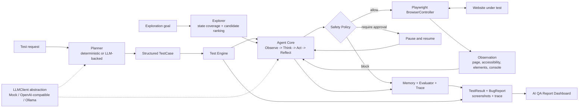

# Vibe-QA

Vibe-QA is a local-first website testing agent that operates a real browser,
evaluates what happened after each action, and produces evidence-backed bug
reports. It is built for indie developers and small teams that need useful QA
coverage without maintaining a large end-to-end test suite.

The current Alpha-0 prototype combines deterministic functional testing,
LLM-ready planning, bounded autonomous exploration, human approval for risky
actions, and a resettable SaaS-style benchmark with five seeded defects.

## Problem

Fast-moving web products often outgrow manual smoke testing before a team can
invest in dedicated QA. Important workflows may silently regress, and failures
such as browser exceptions can be easy to miss even when the page still looks
correct.

Traditional scripted tests are valuable, but every new workflow requires more
test code and maintenance. Vibe-QA explores a complementary approach: give an
agent a goal, let it interact through a constrained browser interface, and keep
the complete trajectory available for review.

## Solution

Vibe-QA provides:

- A typed Playwright browser controller for navigation, interaction, observation,
  screenshots, and console-error capture.
- An agent runtime that follows `Observe -> Think -> Act -> Reflect`, with memory,
  evaluation, step limits, and an explainable execution trace.
- A deterministic safety policy that can allow, block, or pause an action for
  human approval without losing run state.
- A functional test engine that turns structured scenarios into `TestResult` and
  `BugReport` output.
- An exploration engine that fingerprints page states, generates and ranks
  candidates, tracks coverage, and avoids repeated actions.
- A read-only report dashboard for test status, findings, execution traces, and
  browser evidence.
- An abstract planning and LLM layer with mock, OpenAI-compatible, and Ollama
  clients, without coupling the agent to one provider.

The project is intentionally local and benchmark-driven. It is not a hosted QA
platform, and the portfolio demo does not require an API key or paid model.

## Architecture



All browser operations use typed `BrowserAction` values. The safety gate runs
before execution, and observations flow back through the evaluator and trace so
the final result can be inspected rather than taken on trust.

| Area | Existing implementation |
| --- | --- |
| Browser control | `browser-tools`, `browser-playwright` |
| Agent runtime | `agent-core`, including memory, evaluator, trace, and approvals |
| Planning and models | `planner`, `llm` |
| Functional execution | `test-engine`, `test-runner` |
| Autonomous exploration | `explorer` |
| Safety and contracts | `safety-policy`, `schemas` |
| Local product under test | `apps/benchmark-app` |
| Demo and CLI | `apps/cli` |
| Report visualization | `apps/dashboard` |

## Demo

Run the complete local browser-testing demonstration from the repository root:

```bash
npm run demo:qa
```

The command builds the workspace, starts the benchmark application, opens a
visible Chromium browser, signs in, triggers the existing fragile-widget defect,
and prints the real evaluation result. Reports, traces, and screenshots are saved
under `run-output/demo/<timestamp>/`.

Use the successful login scenario or keep the browser open for a presentation:

```bash
npm run demo:qa -- --scenario login
npm run demo:qa -- --scenario bug
npm run demo:qa -- --keep-open
```

For a short explanation, presenter script, and example output, see the
[Technical Demo Guide](docs/TECHNICAL_DEMO.md).

The default demo is deterministic so it remains reliable during a presentation.
The repository also includes LLM-backed planner implementations behind the same
interfaces, but no external model is required for this flow.

## Report Dashboard

After generating at least one demo run, start the local portfolio dashboard:

```bash
npm run dashboard:qa
```

Open the printed URL to review test status, detected issues, executed steps, the
agent timeline, and captured browser screenshots. The dashboard reads existing
artifacts from `run-output/demo/` and never modifies a test run.

Use **Dashboard** for the latest run, **History** for every automatically
discovered run, and **Run Details** for a stable report URL with its timeline and
evidence. History includes run time, status, bugs found, screenshot count, and
duration derived from the trace.

Failed-run details also include a structured bug explanation with a concise
summary, likely root cause, suggested fixes, and severity reasoning. Set
`OPENAI_API_KEY` before starting the dashboard to generate this analysis through
the existing OpenAI-compatible `LLMClient`. Without a key, the same section uses
a clearly labeled local evidence baseline, so report viewing never depends on an
external service. `OPENAI_BASE_URL` and `OPENAI_MODEL` can optionally select a
compatible endpoint and model.

### Create A Test

Start the dashboard and open **New Test**. Choose a testing mode, then provide
the target page, a concise objective such as `Test login functionality`, and the
expected behavior.

- **Functional** creates an assertion-backed `TestCase` for a specific workflow.
- **Exploratory** uses the existing coverage engine to discover and exercise
  safe interactive states without requiring an API key.
- **Regression** creates an expectation-driven plan that checks whether known
  behavior still holds. Cross-run Website Memory remains a future capability.

Functional and regression planning require `OPENAI_API_KEY`. All three modes
execute through the existing Agent and safety policy; functional and regression
use the Test Engine, while exploratory mode uses the existing
`ExplorationSession`. Browser execution remains local through Playwright.

For login-required sites, enable **Temporary login** and enter a username and
password. Credentials remain in memory only for that run: the planner sees
credential placeholders, the browser receives real values only when filling the
login fields, and the values are cleared when execution ends. Every run uses a
fresh Playwright browser context. Credential fields and matching page content
are masked in screenshots and redacted from observations, errors, reports,
traces, request APIs, and AI bug-analysis input. Only the non-sensitive fact
that temporary authentication was used is saved.

The request page shows queued, running, and completed states. Finished runs save
the standard `report.json`, `trace.json`, and screenshots under
`run-output/demo/<timestamp>-request-<id>/`, so they appear automatically in
History and Run Details. The selected mode, target page, objective, expected
behavior, and authentication-used flag are stored with the report. Configuration
fields reject embedded credentials and common secret assignments; login secrets
belong only in the temporary credential fields.

## Development

Requirements: Node.js 18 or later and a supported Chrome or Chromium browser.

```bash
npm install
npm run build
npm test
npm run lint
npm run format:check
```

The strict TypeScript monorepo contains focused unit and browser integration tests
for the benchmark, browser controllers, agent runtime, safety gate, planner, test
engine, runner, explorer, and demo composition.

## Evaluation Benchmark V2

Individual test reports show what happened in one run. The evaluation benchmark
repeats a representative suite against the seeded benchmark application to
measure how reliably Vibe-QA completes expected workflows and detects known
website defects.

Run the deterministic baseline with five repetitions per scenario:

```bash
npm run benchmark:qa
```

Change the repetition count or select a smaller slice:

```bash
npm run benchmark:qa -- --runs 10
npm run benchmark:qa -- --scenario bug-widget-crash
npm run benchmark:qa -- --mode exploratory
```

The report includes task success rate, seeded bug detection rate, false positive
rate, repeated-run stability, safety events, mode-level performance, and
descriptive statistics for step count and execution duration. A website test can
have status `failed` because it exposed a defect while the benchmark result is
`EXPECTED_BUG_FOUND`, which counts as a successful evaluation outcome.

The baseline suite covers successful and rejected authentication, authenticated
dashboard access, project and settings navigation, post-logout route protection,
the seeded fragile-widget defect, and deterministic exploratory coverage.

Each repetition resets the benchmark data and launches a fresh isolated browser
context. The default suite uses deterministic scenarios and requires no external
LLM or paid API. Compact `summary.json`, `runs.json`, and `benchmark-report.md`
artifacts are written to `run-output/benchmark/<timestamp>/`; credentials, raw
traces, and screenshots are not included.

## Generalization Benchmark V3

V3 asks a different question: what value does a planner add when the exact
browser path and bug location are not provided? It runs blind hidden-bug hunts,
ambiguous account and project goals, same-URL dashboard state changes, and
recovery scenarios with realistic safe distractors.

```bash
npm run benchmark:qa -- --suite generalization --planner deterministic --runs 2
npm run benchmark:qa -- --suite generalization --planner ollama --runs 2
npm run benchmark:qa -- --suite generalization --compare deterministic,ollama --runs 3
npm run benchmark:qa -- --suite generalization --compare deterministic,ollama --runs 10
```

The deterministic V3 baseline uses the existing Explorer candidate scoring. It
does not receive a hidden scripted path. Ollama uses the existing Agent and
`LLMClient` loop to select actions from live observations. Both planners receive
only the public goal, start URL, and step budget. Seeded bug IDs, evaluator
selectors, expected action sequences, credentials, and internal benchmark
metadata remain evaluator-only.

V3 reports autonomous discovery, ambiguous-goal completion, useful new states
per action, detours, state revisits, recovery, time to discovery, coverage before
discovery, and success within 5, 10, and maximum steps. Reports include 95%
Wilson confidence intervals for proportion metrics and planner-by-scenario
attempts, successes, step distributions, duration, stability, recovery,
coverage, detours, and revisits. Sample size, model, suite version, and Git
commit are shown beside the results. Metric-derived interpretation calls out
mixed scenario evidence instead of turning one result into a category-wide
claim.

Execution duration includes browser startup, authentication, browser work,
safety checks, and model calls, but excludes browser shutdown and report
writing. For Ollama runs, V3 also records elapsed `LLMClient.generate` wall time
so local planner latency can be separated approximately from the rest of the
workflow. This is request/inference wall time, not pure model compute time.

V3 results remain separate from V2 controlled-workflow reliability so the two
success rates are not conflated. Artifacts use the same
`run-output/benchmark/<timestamp>/` location and include
`suite: "generalization-v3"` metadata.

## Benchmark Comparison

The deterministic strategy is the default reproducible baseline. In V2, an
optional Ollama strategy uses the existing `LLMClient` abstraction and
`qwen2.5-coder:7b` to order known safe scenario steps. In V3, the same local
model selects browser actions autonomously from the public goal and current
observation. Typed credential values are inserted only during local setup and
are not sent to the model. Ollama must be running locally with the model
installed; Vibe-QA reports a clear error instead of silently falling back when
it is unavailable.

The default Ollama endpoint uses the IPv4 loopback address to avoid Windows and
Node resolving `localhost` to an unsupported IPv6 listener. Override it when
Ollama is hosted elsewhere:

```ini
OLLAMA_BASE_URL=http://127.0.0.1:11434
```

```bash
npm run benchmark:qa -- --planner deterministic --runs 10
npm run benchmark:qa -- --planner ollama --runs 5
npm run benchmark:qa -- --difficulty hard --runs 10
npm run benchmark:qa -- --planner ollama --mode exploratory --runs 5
npm run benchmark:qa -- --compare deterministic,ollama --runs 5
```

## Hybrid Planner V2

Hybrid is an explainable task router over the existing deterministic and Ollama
strategies. It remains a small deterministic rules engine, not another LLM
router, and it does not receive benchmark IDs, hidden selectors, evaluator
recommendations, credentials, or secrets.

Hybrid V1 preserved controlled-workflow latency, averaging about 1.14 seconds
versus 1.02 seconds for deterministic and 2.22 seconds for Ollama. Its latest
generalization results were weaker: 15.0% hidden discovery, 37.5% ambiguous-goal
completion, 38.3% recovery, and 30.0% expected-outcome stability. Evaluator-side
routing diagnostics identified the deterministic defaults for ambiguous goals
and same-URL state reasoning as evidence-sensitive weaknesses.

Hybrid V2 uses this explicit precedence:

1. Regression and known functional workflows with clear expectations use
   deterministic execution.
2. Hidden-issue discovery and explicit exploration use Ollama.
3. Recovery without a known path and same-URL semantic state reasoning use
   Ollama.
4. Ambiguous semantic goals without an explicit workflow use Ollama.
5. Unknown cases retain the deterministic fallback.

Each decision records its rule, explanation, and deterministic confidence level
(`high`, `medium`, or `low`). Low-confidence routes still execute the selected
planner; Hybrid does not invoke another router, run both planners, or silently
change strategies.

```bash
npm run benchmark:qa -- --planner hybrid --runs 3
npm run benchmark:qa -- --suite generalization --planner hybrid --runs 3
npm run benchmark:qa -- --suite generalization --compare deterministic,ollama,hybrid --runs 3
```

The benchmark default remains deterministic. Benchmark Hybrid mode does not
silently fall back when Ollama is unavailable: the selected planner, executed
planner, routing rule, reason, availability failure, and fallback status remain
visible in run metadata. This prevents a deterministic fallback from being
counted as an Ollama execution.

Reports preserve the existing V4 section and add **Benchmark V4.1 - Hybrid
Routing Refinement**. Diagnostics include routing distribution, a confusion
matrix, agreement by scenario and category, rule and confidence performance,
historical alternative-planner comparisons, and routing-regret estimates. A
route has material estimated regret when the alternative planner's measured
success on the same scenario is at least 20 percentage points higher. Agreement
and regret are evaluator-side diagnostic proxies, not proof of causal
optimality, and evaluator recommendations are attached only after execution.
V2 controlled and V3 generalization metrics remain backward compatible.

The latest V2 robustness snapshot used 180 executions, with 60 per planner.
Hybrid V2 improved over the persisted V1 baseline on hidden discovery (20.0%
versus 15.0%), ambiguous goals (77.5% versus 37.5%), recovery (61.1% versus
38.3%), exploration efficiency (0.521 versus 0.454), state revisits (33.7%
versus 44.7%), and expected-outcome stability (58.3% versus 30.0%). However,
all current generalization scenarios matched Ollama-oriented rules, so Hybrid
averaged 7.14 seconds versus 6.20 seconds for pure Ollama and 1.20 seconds for
deterministic. Controlled Hybrid remained near deterministic at 1.16 seconds
versus 1.04 seconds. The result supports V2's quality improvement but not a
generalization-latency or routing-regret improvement; local model variability
and the current scenario mix remain important limitations.

## Adaptive Execution

Hybrid V2 makes one routing decision before execution. Its measured quality
improved, but static routing sent every current generalization scenario to
Ollama and therefore did not improve generalization latency. Adaptive Execution
V1 instead starts every task with the deterministic strategy and monitors only
runtime-observable evidence: repeated page states, no-progress windows, failed
actions or evaluations, stalled recovery, exhausted safe candidates, and the
deterministic step budget.

The balanced product defaults allow at most one transition from deterministic
to Ollama: four deterministic steps, two visits to an equivalent state, two
failed actions, or three no-progress observations can trigger escalation. The
same Agent and browser session continue after escalation, preserving the current
page, authentication, action history, Memory, Trace, Safety Policy state, and
step budget. Scenario IDs, benchmark labels, seeded bug IDs, hidden selectors,
evaluator recommendations, credentials, and secrets never participate in the
decision.

```bash
npm run benchmark:qa -- --planner adaptive --runs 3
npm run benchmark:qa -- --suite generalization --planner adaptive --runs 3
npm run benchmark:qa -- --suite generalization --compare deterministic,ollama,hybrid,adaptive --runs 3
```

Ollama availability is checked lazily only when escalation is required. If it
is unavailable, the run remains labeled Adaptive, records degraded execution
and the failed escalation, and is never counted as an Ollama execution. V5
reports include escalation and avoided-LLM rates, successful escalation,
pre/post escalation steps and time, invocation count, escalation utility, and
conservative/balanced/aggressive threshold projections. Those projections are
evaluator-side analysis only; they do not silently change product defaults.

Adaptive V1 is deliberately conservative and one-way. It does not use an LLM
router, restart the task, or cycle between planners. Its effectiveness must be
judged from measured controlled and generalization comparisons; escalation can
still be late, unnecessary, or unable to recover within the remaining step
budget.

### Adaptive Failure Diagnostics

Generalization reports include an evaluator-only **Adaptive Escalation Failure
Analysis**. Each Adaptive run is split into deterministic, handoff, and Ollama
phases and records sanitized state summaries, remaining budget, planner output
classification, termination reason, repeated-state trigger quality, and
opportunity loss. The report also compares pure Ollama with escalated Ollama
when both planners are included in the same benchmark session. Hidden bug IDs,
hidden selectors, credentials, and raw prompts are never added to the handoff
snapshot.

Diagnostic replay can cap post-escalation actions without changing production
Adaptive defaults:

```bash
npm run benchmark:qa -- --suite generalization --planner adaptive --runs 3 --adaptive-debug-replay --post-escalation-steps 1
npm run benchmark:qa -- --suite generalization --planner adaptive --runs 3 --adaptive-debug-replay --post-escalation-steps 3
npm run benchmark:qa -- --suite generalization --planner adaptive --runs 3 --adaptive-debug-replay --post-escalation-steps 6
```

Replay mode reruns the deterministic local benchmark to the same handoff state
inside an isolated browser session and varies only the diagnostic
post-escalation cap. It is a debugging aid, not a production policy change.

Scenarios are labeled by meaningful execution demands:

- `easy`: short direct workflows with obvious controls.
- `medium`: multi-step state transitions, validation, navigation, or seeded bug
  verification.
- `hard`: exploratory discovery with broader candidate and page-state coverage.

Reports group task success, bug detection, false positives, infrastructure
errors, steps, duration, and repeated-run stability by planner, mode,
difficulty, and scenario. Exploratory groups also include page states,
interactive elements, candidate actions, and normalized coverage. Duration and
step distributions include count, mean, median, minimum, maximum, and standard
deviation. Same-session multi-planner runs additionally create
`comparison.json`; a comparison column is never emitted for a strategy that was
not executed.

The generated Markdown report includes configuration and Git revision metadata
alongside explicit limitations. It is a controlled-site evaluation, not a claim
of universal website-testing accuracy, and Ollama results can vary by model and
environment.

## Repository Map

```text
apps/
  benchmark-app/       Resettable SaaS-style target with five seeded bugs
  benchmark-runner/    Comparative repeated evaluation CLI
  cli/                 CLI and visible technical demo
  dashboard/           Read-only report and evidence dashboard
  worker/              Worker application boundary
packages/
  adaptive-execution/ Runtime progress monitoring and one-way escalation
  agent-core/          Agent loop, memory, evaluator, trace, approvals
  browser-tools/       Browser session abstraction and observations
  browser-playwright/  Playwright BrowserController implementation
  evaluation/          Benchmark classification, metrics, runner, and reporter
  explorer/            Page-state coverage and candidate exploration
  llm/                 Provider-neutral clients and test doubles
  planner/             Browser-action and TestCase planners
  safety-policy/       Deterministic action risk decisions
  schemas/             Shared browser action and observation contracts
  test-engine/         Functional execution, evaluation, and BugReport output
  test-runner/         JSON scenario loading and ordered execution
docs/                  Product, architecture, agent, scope, and demo documents
```

## Future Improvements

- Add a lightweight benchmark history view that reads the generated evaluation
  summaries without coupling the dashboard to benchmark execution.
- Persist website memory across runs and compare page-state changes over time.
- Prioritize regression testing around changed or historically fragile workflows.
- Expand semantic hypothesis generation while retaining deterministic baselines.
- Add stronger reproduction and confidence scoring for suspected failures.
- Broaden evidence collection and benchmark evaluation without weakening the
  typed browser boundary or human approval gate.

## Project Status

Vibe-QA is an Alpha-0 engineering prototype. The implemented foundation proves a
local, explainable, safety-aware browser testing loop against a controlled
benchmark. Production persistence, cloud execution, a hosted UI, and multi-browser
support remain outside the current scope.

For deeper design context, see [Architecture](docs/ARCHITECTURE.md),
[Agent Design](docs/AGENT_DESIGN.md), [MVP Scope](docs/MVP_SCOPE.md), and the
[Implementation Plan](docs/IMPLEMENTATION_PLAN.md).
