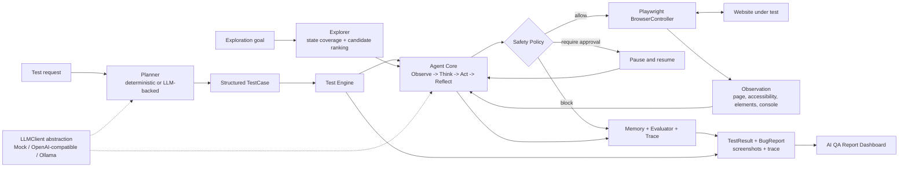

# Vibe-QA

Vibe-QA is a local-first website testing agent that operates a real browser,
evaluates what happened after each action, and produces evidence-backed bug
reports. It is built for indie developers and small teams that need useful QA
coverage without maintaining a large end-to-end test suite.

The current Alpha-0 prototype combines deterministic functional testing,
LLM-ready planning, bounded autonomous exploration, human approval for risky
actions, and a resettable SaaS-style benchmark with five seeded defects.

## Problem

Fast-moving web products often outgrow manual smoke testing before a team can
invest in dedicated QA. Important workflows may silently regress, and failures
such as browser exceptions can be easy to miss even when the page still looks
correct.

Traditional scripted tests are valuable, but every new workflow requires more
test code and maintenance. Vibe-QA explores a complementary approach: give an
agent a goal, let it interact through a constrained browser interface, and keep
the complete trajectory available for review.

## Solution

Vibe-QA provides:

- A typed Playwright browser controller for navigation, interaction, observation,
  screenshots, and console-error capture.
- An agent runtime that follows `Observe -> Think -> Act -> Reflect`, with memory,
  evaluation, step limits, and an explainable execution trace.
- A deterministic safety policy that can allow, block, or pause an action for
  human approval without losing run state.
- A functional test engine that turns structured scenarios into `TestResult` and
  `BugReport` output.
- An exploration engine that fingerprints page states, generates and ranks
  candidates, tracks coverage, and avoids repeated actions.
- A read-only report dashboard for test status, findings, execution traces, and
  browser evidence.
- An abstract planning and LLM layer with mock, OpenAI-compatible, and Ollama
  clients, without coupling the agent to one provider.

The project is intentionally local and benchmark-driven. It is not a hosted QA
platform, and the portfolio demo does not require an API key or paid model.

## Architecture



All browser operations use typed `BrowserAction` values. The safety gate runs
before execution, and observations flow back through the evaluator and trace so
the final result can be inspected rather than taken on trust.

| Area | Existing implementation |
| --- | --- |
| Browser control | `browser-tools`, `browser-playwright` |
| Agent runtime | `agent-core`, including memory, evaluator, trace, and approvals |
| Planning and models | `planner`, `llm` |
| Functional execution | `test-engine`, `test-runner` |
| Autonomous exploration | `explorer` |
| Safety and contracts | `safety-policy`, `schemas` |
| Local product under test | `apps/benchmark-app` |
| Demo and CLI | `apps/cli` |
| Report visualization | `apps/dashboard` |

## Demo

Run the complete local browser-testing demonstration from the repository root:

```bash
npm run demo:qa
```

The command builds the workspace, starts the benchmark application, opens a
visible Chromium browser, signs in, triggers the existing fragile-widget defect,
and prints the real evaluation result. Reports, traces, and screenshots are saved
under `run-output/demo/<timestamp>/`.

Use the successful login scenario or keep the browser open for a presentation:

```bash
npm run demo:qa -- --scenario login
npm run demo:qa -- --scenario bug
npm run demo:qa -- --keep-open
```

For a short explanation, presenter script, and example output, see the
[Technical Demo Guide](docs/TECHNICAL_DEMO.md).

The default demo is deterministic so it remains reliable during a presentation.
The repository also includes LLM-backed planner implementations behind the same
interfaces, but no external model is required for this flow.

## Report Dashboard

After generating at least one demo run, start the local portfolio dashboard:

```bash
npm run dashboard:qa
```

Open the printed URL to review test status, detected issues, executed steps, the
agent timeline, and captured browser screenshots. The dashboard reads existing
artifacts from `run-output/demo/` and never modifies a test run.

Use **Dashboard** for the latest run, **History** for every automatically
discovered run, and **Run Details** for a stable report URL with its timeline and
evidence. History includes run time, status, bugs found, screenshot count, and
duration derived from the trace.

Failed-run details also include a structured bug explanation with a concise
summary, likely root cause, suggested fixes, and severity reasoning. Set
`OPENAI_API_KEY` before starting the dashboard to generate this analysis through
the existing OpenAI-compatible `LLMClient`. Without a key, the same section uses
a clearly labeled local evidence baseline, so report viewing never depends on an
external service. `OPENAI_BASE_URL` and `OPENAI_MODEL` can optionally select a
compatible endpoint and model.

### Create A Test

Start the dashboard and open **New Test**. Choose a testing mode, then provide
the target page, a concise objective such as `Test login functionality`, and the
expected behavior.

- **Functional** creates an assertion-backed `TestCase` for a specific workflow.
- **Exploratory** uses the existing coverage engine to discover and exercise
  safe interactive states without requiring an API key.
- **Regression** creates an expectation-driven plan that checks whether known
  behavior still holds. Cross-run Website Memory remains a future capability.

Functional and regression planning require `OPENAI_API_KEY`. All three modes
execute through the existing Agent and safety policy; functional and regression
use the Test Engine, while exploratory mode uses the existing
`ExplorationSession`. Browser execution remains local through Playwright.

For login-required sites, enable **Temporary login** and enter a username and
password. Credentials remain in memory only for that run: the planner sees
credential placeholders, the browser receives real values only when filling the
login fields, and the values are cleared when execution ends. Every run uses a
fresh Playwright browser context. Credential fields and matching page content
are masked in screenshots and redacted from observations, errors, reports,
traces, request APIs, and AI bug-analysis input. Only the non-sensitive fact
that temporary authentication was used is saved.

The request page shows queued, running, and completed states. Finished runs save
the standard `report.json`, `trace.json`, and screenshots under
`run-output/demo/<timestamp>-request-<id>/`, so they appear automatically in
History and Run Details. The selected mode, target page, objective, expected
behavior, and authentication-used flag are stored with the report. Configuration
fields reject embedded credentials and common secret assignments; login secrets
belong only in the temporary credential fields.

## Development

Requirements: Node.js 18 or later and a supported Chrome or Chromium browser.

```bash
npm install
npm run build
npm test
npm run lint
npm run format:check
```

The strict TypeScript monorepo contains focused unit and browser integration tests
for the benchmark, browser controllers, agent runtime, safety gate, planner, test
engine, runner, explorer, and demo composition.

## Evaluation Benchmark

Individual test reports show what happened in one run. The evaluation benchmark
repeats a representative suite against the seeded benchmark application to
measure how reliably Vibe-QA completes expected workflows and detects known
website defects.

Run the deterministic baseline with five repetitions per scenario:

```bash
npm run benchmark:qa
```

Change the repetition count or select a smaller slice:

```bash
npm run benchmark:qa -- --runs 10
npm run benchmark:qa -- --scenario bug-widget-crash
npm run benchmark:qa -- --mode exploratory
```

The report includes task success rate, seeded bug detection rate, false positive
rate, repeated-run stability, safety events, mode-level performance, and
descriptive statistics for step count and execution duration. A website test can
have status `failed` because it exposed a defect while the benchmark result is
`EXPECTED_BUG_FOUND`, which counts as a successful evaluation outcome.

The baseline suite covers successful and rejected authentication, authenticated
dashboard access, project and settings navigation, post-logout route protection,
the seeded fragile-widget defect, and deterministic exploratory coverage.

Each repetition resets the benchmark data and launches a fresh isolated browser
context. The default suite uses deterministic scenarios and requires no external
LLM or paid API. Compact `summary.json`, `runs.json`, and `benchmark-report.md`
artifacts are written to `run-output/benchmark/<timestamp>/`; credentials, raw
traces, and screenshots are not included.

## Benchmark Comparison

The deterministic strategy is the default reproducible baseline. An optional
Ollama strategy uses the existing `LLMClient` abstraction and
`qwen2.5-coder:7b` to order known safe scenario steps. Typed credential values
are inserted only during local execution and are not sent to the model. Ollama
must be running locally with the model installed; Vibe-QA reports a clear error
instead of silently falling back when it is unavailable.

```bash
npm run benchmark:qa -- --planner deterministic --runs 10
npm run benchmark:qa -- --planner ollama --runs 5
npm run benchmark:qa -- --difficulty hard --runs 10
npm run benchmark:qa -- --planner ollama --mode exploratory --runs 5
npm run benchmark:qa -- --compare deterministic,ollama --runs 5
```

Scenarios are labeled by meaningful execution demands:

- `easy`: short direct workflows with obvious controls.
- `medium`: multi-step state transitions, validation, navigation, or seeded bug
  verification.
- `hard`: exploratory discovery with broader candidate and page-state coverage.

Reports group task success, bug detection, false positives, infrastructure
errors, steps, duration, and repeated-run stability by planner, mode,
difficulty, and scenario. Exploratory groups also include page states,
interactive elements, candidate actions, and normalized coverage. Duration and
step distributions include count, mean, median, minimum, maximum, and standard
deviation. Same-session multi-planner runs additionally create
`comparison.json`; a comparison column is never emitted for a strategy that was
not executed.

The generated Markdown report includes configuration and Git revision metadata
alongside explicit limitations. It is a controlled-site evaluation, not a claim
of universal website-testing accuracy, and Ollama results can vary by model and
environment.

## Repository Map

```text
apps/
  benchmark-app/       Resettable SaaS-style target with five seeded bugs
  benchmark-runner/    Comparative repeated evaluation CLI
  cli/                 CLI and visible technical demo
  dashboard/           Read-only report and evidence dashboard
  worker/              Worker application boundary
packages/
  agent-core/          Agent loop, memory, evaluator, trace, approvals
  browser-tools/       Browser session abstraction and observations
  browser-playwright/  Playwright BrowserController implementation
  evaluation/          Benchmark classification, metrics, runner, and reporter
  explorer/            Page-state coverage and candidate exploration
  llm/                 Provider-neutral clients and test doubles
  planner/             Browser-action and TestCase planners
  safety-policy/       Deterministic action risk decisions
  schemas/             Shared browser action and observation contracts
  test-engine/         Functional execution, evaluation, and BugReport output
  test-runner/         JSON scenario loading and ordered execution
docs/                  Product, architecture, agent, scope, and demo documents
```

## Future Improvements

- Add a lightweight benchmark history view that reads the generated evaluation
  summaries without coupling the dashboard to benchmark execution.
- Persist website memory across runs and compare page-state changes over time.
- Prioritize regression testing around changed or historically fragile workflows.
- Expand semantic hypothesis generation while retaining deterministic baselines.
- Add stronger reproduction and confidence scoring for suspected failures.
- Broaden evidence collection and benchmark evaluation without weakening the
  typed browser boundary or human approval gate.

## Project Status

Vibe-QA is an Alpha-0 engineering prototype. The implemented foundation proves a
local, explainable, safety-aware browser testing loop against a controlled
benchmark. Production persistence, cloud execution, a hosted UI, and multi-browser
support remain outside the current scope.

For deeper design context, see [Architecture](docs/ARCHITECTURE.md),
[Agent Design](docs/AGENT_DESIGN.md), [MVP Scope](docs/MVP_SCOPE.md), and the
[Implementation Plan](docs/IMPLEMENTATION_PLAN.md).
