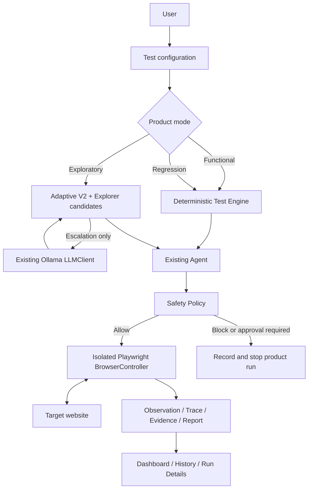

# Vibe-QA v0.1.0-alpha Architecture Freeze

Status: frozen for Alpha product finalization. This document describes the
implemented execution architecture and takes precedence over earlier design
proposals. It is not a new planner milestone or a package-version release.

## Execution Policy

| Product mode | Internal default | Priority |
| --- | --- | --- |
| Functional | Deterministic Test Engine | Reliable, reproducible known-path checks |
| Regression | Deterministic Test Engine | Repeated expectation checks with low latency |
| Exploratory | Adaptive V2, then local Ollama only on escalation | Preserve live exploration opportunity |

`apps/dashboard/src/alpha-policy.ts` is the product mapping. The normal form has
only these three modes, a target page, objective, expected behavior, and optional
temporary login. It has no model, router, benchmark, or policy-version selector.
The analysis client is independent of execution: configuring paid bug analysis
does not change test strategy.



No Agent, Explorer, Planner, browser, safety, LLM, or Test Engine API was
redesigned for the freeze. Dashboard composition reuses the existing Adaptive
controller and Agent, Explorer candidate generation/fingerprints, and Test
Evaluator. Benchmark execution remains independent of the product mapping.

## Module Classification

| Category | Modules and responsibilities |
| --- | --- |
| CORE | `agent-core` (Agent/AgentLoop, Memory, state, Evaluator, trace, approvals); Planner and TestPlanner interfaces; `browser-tools` / `browser-playwright` (BrowserController and isolated sessions); `test-engine`; `test-runner`; `explorer`; Adaptive V2 in `adaptive-execution`; `safety-policy`; `schemas`; `llm` abstraction and provider clients; secure temporary-credential/browser boundary currently housed in the dashboard |
| PRODUCT | `apps/cli`, technical demo, `apps/dashboard`, test creation and mode mapping, run history, reports/evidence views, optional bug analysis |
| EVALUATION | `apps/benchmark-app`, `apps/benchmark-runner`, `packages/evaluation`, generated benchmark reports, routing metrics, Adaptive failure diagnostics; none is imported by the product executor |
| EXPERIMENTAL | Hybrid V2 router, direct/pure Ollama benchmark strategy, Adaptive policy version switches and V1 compatibility; existing injectable LLM TestPlanner remains an advanced API, not a product mode |
| DEFERRED | LangGraph, LangChain, CrewAI, Browser Use replacement, multi-agent orchestration, learned routing, reinforcement learning, vector databases, cloud orchestration; `apps/worker`, `packages/prompts`, and `packages/test-fixtures` remain foundation placeholders |

Authentication is classified by responsibility, not directory: moving it out of
the dashboard is intentionally not part of this freeze. Cross-run Website Memory,
automatic regression selection, and production persistence remain deferred.

## Defaults and Boundaries

- Release presentation lives in the dashboard adapter. `product-outcome.ts`
  interprets existing safety/trace/errors for user-facing labels; it does not
  replace TestEvaluator or change any planner decision. Raw reports remain intact.
  Labels distinguish passed checks, target console/page issues, assertion failures,
  safety blocks, approval-required stops, unsupported objectives, and agent/model/
  browser/infrastructure errors. Unexecuted-step and runtime failures are not
  counted as website findings or sent for target-bug analysis. Independent captured
  console/assertion findings remain available even when execution is interrupted.
- Product Exploratory uses the existing Agent evaluator injection point for
  redirect-aware navigation and clear page-error detection. Optional observation
  navigation metadata records requested/final URLs, main-document HTTP status, and
  the observed HTTP redirect chain. Functional/Regression URL expectations remain
  strict. A confirmed page-error signal records evidence and ends exploration with
  `page-error`, not `agent-error`. No Adaptive or Agent Core strategy changes are
  involved. See [navigation acceptance](ALPHA_EXPLORATORY_NAVIGATION_ACCEPTANCE.md).
- New Test is ordered target URL, mode, objective, final text, and optional login.
  Functional/Regression retain an explicitly required final text check in the local
  form; Exploratory text remains optional. Summary views show mode, target, outcome,
  timing, findings, and evidence, with technical details expandable below.

- No paid API is required. Functional/Regression never call a model by default.
- The local form builds a deterministic page-text check. With temporary login,
  it uses live observed selectors for one username/password/sign-in form, then
  verifies **Expected visible page text**. Matching is literal and case-sensitive,
  with whitespace trimmed/collapsed on both sides. Every non-empty expected line
  must occur in the full rendered page text, independently of order/adjacency.
  Duplicate lines require only one occurrence. This is not a natural-language
  assertion. Full text stays in the TestTask evaluator's temporary snapshot;
  agent observation samples, prompts, and traces are not expanded.
- Complex known paths continue to use existing structured TestCase/TestRunner
  APIs. The Alpha form does not synthesize arbitrary CRUD or multi-page workflows.
- Functional objective handling is bounded and deterministic: page-text check,
  temporary login, explicit native form commands, or one exact-label navigation
  action followed by verification.
  For navigation, the single-line expected text also identifies the unique visible
  control. A successful click and URL change are required before accepting the
  final text assertion. Unsupported/ambiguous requests stop, never degrade into
  assertion-only success. Same-URL interactions and longer workflows require
  explicit structured TestCase/TestRunner APIs. The optional injected Functional
  planner is also checked for action-before-verification consistency; it is not
  enabled by default. No LLM judge, router, or browser API is added.
- Explicit form commands map in order to existing `type` and `click` actions,
  followed by a bounded wait and the normalized visible-text assertion. Native
  selects reuse `type(selector, optionLabel)` through Playwright `selectOption`;
  other inputs retain `fill`. The shared observation collector only gains native
  select label association. There are no new BrowserAction variants or control
  engines. Unsupported instructions/controls fail rather than being omitted.
- TestTask and the product executor accept an optional `onApproval` callback,
  forwarding the decision to the existing Agent approval/resume API. No handler
  means no approval; blocked actions cannot be overridden. Agent Core and the
  safety policy are unchanged. No persistent consent or approval UI is added.
- Exploratory uses the existing Adaptive V2 thresholds, bounded null retry and
  completion gate, with a 12-action product budget. It can stop when safe local
  candidates are exhausted; it does not expand total budgets to improve scores.
- The local model is `qwen2.5-coder:7b`. The existing OllamaClient resolves explicit
  base URL, then `OLLAMA_BASE_URL`, then `http://127.0.0.1:11434`. IPv4 avoids Windows
  IPv6 localhost resolution failures. Model calls occur only inside Adaptive.
- Unavailable models and unresolved post-handoff nulls produce unsuccessful
  results, not a silently successful deterministic fallback.
- Fresh browser contexts and in-memory temporary credentials remain mandatory.
  Credentials are redacted before model/evidence exposure and cleared on cleanup.
- The existing safety gate is retained. Core pause/resume APIs remain available;
  the dashboard has no approval-resume UI and closes its run safely on a pending
  approval. Product exploration blocks explicit off-origin actions and keeps
  screenshots within its evidence directory. Redirect/pop-up containment is not
  a hardened network sandbox.
- Standard product reports stay under gitignored `run-output/demo/`; research
  reports stay under `run-output/benchmark/`. Research diagnostics do not become
  product inputs or new UI choices.

Example local configuration (set in the process environment, do not commit secrets):

```ini
OLLAMA_BASE_URL=http://127.0.0.1:11434
```

Run `npm run dashboard:qa` for the product and `npm run demo:qa` for the reliable
deterministic presentation. Existing advanced benchmark options remain intact:
`--planner ollama`, `--planner hybrid`, and `--planner adaptive --adaptive-policy v1`.

## Evidence Behind the Decision

The completed Adaptive V2 experiment, not a new benchmark, supports this policy.
The controlled sample remained 8/8 successful, 0 escalations, 100% avoided LLM,
and approximately 1.0s mean duration.

| Generalization, 60 executions each | Expected outcome | Hidden discovery | Ambiguous goals | Recovery | Mean duration |
| --- | --- | --- | --- | --- | --- |
| Deterministic | 50.0% | 0% | 75.0% | 50.0% | 1.30s |
| Pure Ollama | 56.7% | 30.0% | 70.0% | 75.0% | 6.45s |
| Hybrid V2 | 66.7% | 40.0% | 80.0% | 74.1% | 6.97s |
| Adaptive V2 | 71.7% | 35.0% | 90.0% | 77.1% | 10.99s |

Source: completed local artifact `2026-08-28T08-42-28-433Z`, 240 executions.
Adaptive retained 100% measured opportunity, averaged 3.9 post-handoff actions,
and recovered 48.5% of rejected null decisions. In the separate 3-repetition A/B
sample, expected-outcome success rose from 27.8% (V1) to 66.7% (V2), while hidden
discovery rose from 16.7% to 33.3%. These small controlled samples are not proof
of universal website-testing accuracy.

Deterministic execution stays because known workflows need reproducibility and
speed. Adaptive V2 is chosen for discovery because it avoids destroying the
starting opportunity before model handoff, not because it is the fastest method.
V2 did not achieve the full latency tradeoff: every generalization run escalated,
26/60 were classified unnecessary, session-protection discovery remained 0/10,
and early termination remained a leading failure. No new thresholds, scenarios,
router, or Adaptive V3 work is authorized by this freeze.

## Review Gate

Real-world Alpha acceptance and product presentation preparation are documented in
[release readiness](ALPHA_RELEASE_READINESS.md). The execution freeze remains in
effect. Await final release review; do not create a tag, publish a release, or begin
another milestone automatically. Preserve evaluation/reference capabilities and
keep research policy versions and benchmark controls out of ordinary configuration.

Interactive approval UI was reviewed and deferred. A consistent implementation
would need retained request-to-Agent ownership for both Functional and Exploratory,
bounded consent expiry, browser/credential cleanup on abandoned requests and server
shutdown, and authenticated request-ID handling. The existing product executor
always closes its browser on return, and Exploratory does not use TestTask's
callback loop. Changing those lifecycles is beyond a small presentation patch.
The existing safe-stop and developer approval APIs remain available and tested.
